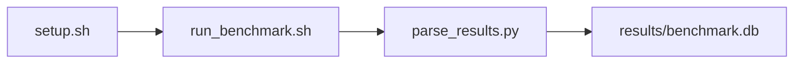

# GUPS Random Memory Benchmark

[](LICENSE)
[](https://github.com/garys-gpu-benchmarks/313-sys-bench-amd-gups-random-memory-ubu2604/actions/workflows/ci.yml)

Target: Ubuntu 26.04 · AMD · see Hardware Requirements. This is a host benchmark, not a laptop `pip install` project.

## Quick Start

```bash
git clone https://github.com/garys-gpu-benchmarks/313-sys-bench-amd-gups-random-memory-ubu2604.git
cd 313-sys-bench-amd-gups-random-memory-ubu2604
sudo bash setup.sh --assume-yes
bash run_benchmark.sh --profile smoke --validate
```
Results are written to `results/benchmark.db` and `results/summary.json`.

This workload is executed on the validation host after the repository is copied there. `setup.sh` and `run_benchmark.sh` do not open an outbound SSH session.

Prerequisites: Ubuntu 26.04; AMD; Python 3.14.4; root or sudo for `setup.sh`. Framework: Bash, SQLite, Python, PyYAML, C (not C++), GCC, OpenMP, NumPy. This is a host benchmark, not a laptop `pip install` project.



## 1. Overview

Compiles an embedded C OpenMP GUPS kernel with gcc and runs it under perf stat for dTLB and LLC misses when perf is available. NumPy random updates run only if gcc fails. table_size, num_updates, num_iterations, and seed come from yaml. This is not a separate gups_benchmark.cpp binary. Sweep dimensions: numa_node, num_threads, thread_affinity, page_size, table_size, num_updates, num_iterations, seed.

## 2. What It Validates

- Validates GUPS throughput and TLB/L3 miss rates from the compiled C OpenMP kernel. NumPy runs only if gcc is missing or the build fails
- #1: Giga-updates score (giga_updates_score); is present and physically sensible.
- #2: Random 64-bit update rate (updates_sec); is present and physically sensible.
- #3: 8-byte payload update rate, GB/s (payload_update_gb_s); is present and physically sensible.
- #4: TLB miss rate (tlb_miss_rate); is present and physically sensible.
- #5: L3 cache miss rate (l3_miss_rate) is present and physically sensible.

## 3. Metrics Captured

- **#1: Giga-updates score** — stored as `giga_updates_score`.
- **#2: Random 64-bit update rate** — stored as `updates_sec`.
- **#3: 8-byte payload update rate, GB/s** — stored as `payload_update_gb_s`.
- **#4: TLB miss rate** — stored as `tlb_miss_rate`.
- **#5: L3 cache miss rate** — stored as `l3_miss_rate`.

## 4. Hardware Requirements

### Supported environment

- OS: Ubuntu 26.04
- GPU vendor: AMD
- Framework family: Bash, SQLite, Python, PyYAML, C (not C++), GCC, OpenMP, NumPy
- Python: Python 3.14.4

### Reference validation environment

The tables below describe the machine used to generate the reference results. They are not a requirement that every user buy that exact cloud instance.

### System

Ubuntu 26.04 / AMD / Bash, SQLite, Python, PyYAML, C (not C++), GCC, OpenMP, NumPy

### GPU

Ubuntu 26.04 / AMD / Bash, SQLite, Python, PyYAML, C (not C++), GCC, OpenMP, NumPy

## 5. Software Requirements

| Component | Version |
|---|---|
| OS | Ubuntu 26.04 |
| Kernel | kernel 7.0.0 |
| Python | Python 3.14.4 |
| ROCm | N/A - ROCm not used |
| rocBLAS | N/A - rocBLAS not used |

Compiles an embedded C OpenMP GUPS kernel with gcc and runs it under perf stat for dTLB and LLC misses when perf is available. NumPy random updates run only if gcc fails. table_size, num_updates, num_iterations, and seed come from yaml.

## 6. Installation

```bash
Compile an embedded C OpenMP GUPS kernel with gcc and run it under perf stat when available. NumPy is only the gcc fallback
```

## 7. Running the Benchmark

```bash
Compile an embedded C OpenMP GUPS kernel with gcc and run it under perf stat when available. NumPy is only the gcc fallback
```

**Validating results separately:**

```bash
export BENCHMARK_PYTHON=/usr/bin/python3.13  # optional
python3 -m venv .venv
source ".venv/bin/activate"
".venv/bin/python" scripts/validate_results.py
```

## 8. Output

### `results/benchmark.db` (SQLite)

CSV with one kind=sample row and one kind=summary row

kind,seconds,updates,total_updates,gups,giga_updates_score,errors,updates_sec,table_size,num_updates,elapsed_sec,tlb_miss_rate,l3_miss_rate,payload_update_gb_s
sample,1.5,1000000,1000000,0.000667,0.000667,0,666666,4194304,1000000,1.5,0.02,0.4,0.0053

```bash
Compile an embedded C OpenMP GUPS kernel with gcc and run it under perf stat when available. NumPy is only the gcc fallback
```

### `results/summary.json`

Consolidated metrics from the most recent run — suitable for CI artifact upload or dashboard ingestion.

### `results/raw/<timestamp>.txt`

CSV with one kind=sample row and one kind=summary row

kind,seconds,updates,total_updates,gups,giga_updates_score,errors,updates_sec,table_size,num_updates,elapsed_sec,tlb_miss_rate,l3_miss_rate,payload_update_gb_s
sample,1.5,1000000,1000000,0.000667,0.000667,0,666666,4194304,1000000,1.5,0.02,0.4,0.0053

## 9. Baselines / Thresholds

Expected ranges and gates live in `config/benchmark_config.yaml` under `baselines:` or `thresholds:`. To update them, edit that file — never edit validation code directly.

## 10. Troubleshooting

**`setup.sh` missing collector**
Create cannot finish without `scripts/collect_workload.py`.

**`self_check` overlay rewritten**
Do not overwrite files listed in `results/overlay_lock.json`.

**Remote SSH drop during setup**
Reconnect and resume `bash setup.sh --assume-yes`. Do not wipe `.venv` or `.cache`.

## 11. NVIDIA H100 Coding Differences

Primary target is AMD ROCm. NVIDIA notes in this section are reference only and are not the execution path.

## Repository layout

```text
.
├── setup.sh
├── run_benchmark.sh
├── benchmark_specification.json
├── .github/workflows/      # thin CI callers (see Continuous Integration)
├── config/
├── scripts/
├── src/
├── tests/
├── docs/
├── results/
└── LICENSE
```

## Continuous Integration

| Workflow | Runs on | When | What it does |
|---|---|---|---|
| [CI](.github/workflows/ci.yml) | GitHub-hosted runner | every pull request, and every push to `main` | shellcheck, ruff, `bash -n`, `compileall`, `run_benchmark.sh --help`, specification schema, the results validator on a seeded fixture, required files, and actionlint. No GPU and no benchmark run. |
| [GPU Smoke Benchmark](.github/workflows/gpu-smoke.yml) | self-hosted runner labeled `gpu`, `amd`, `ubu2604` | only when started by hand: **Actions → GPU Smoke Benchmark → Run workflow** (choose `smoke`, `baseline` or `extended`) | Verifies the pre-provisioned GPU stack, records `results/environment.json` (driver, runtime, kernel, GPU), runs the profile with `--validate`, shows headline metrics on the run page, and uploads the results. |

Both files are short callers. The steps themselves live once, for every workload in the suite, in [`garys-gpu-benchmarks/shared-workflows`](https://github.com/garys-gpu-benchmarks/shared-workflows), pinned at `@v1`. The GPU workflow is never triggered by pull requests, so code from a fork cannot run on the GPU host.

### Running it as part of the AMD Ubuntu 26.04 bundle

This repository is one of the 32 workloads in [`bundle-amd-ubuntu-2604`](https://github.com/garys-gpu-benchmarks/bundle-amd-ubuntu-2604), which holds them as git submodules. To put the whole bundle on a GPU host and run this workload from it:

```bash
git clone --recurse-submodules https://github.com/garys-gpu-benchmarks/bundle-amd-ubuntu-2604 /opt/benchmarks
cd /opt/benchmarks/313-sys-bench-amd-gups-random-memory-ubu2604
bash run_benchmark.sh --profile smoke --validate
```
